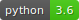
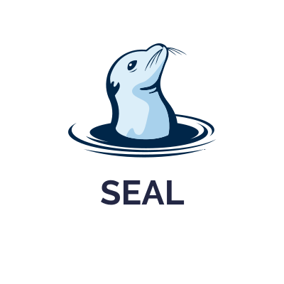

# SEAL
[](.github/python_version.svg)
[](.github/logo.svg)

Experimenting is a crucial part of machine learning projects and we believe that structured experimentations bring more understandable and explainable results. Following our belief, we propose SEAL, a python framework that tries to improve structure and method in machine learning experimentations, in addition, to provide an autoML backend support.

In this way, we want the user to focus on the experimentation design phase, by defining a set of consistent parameters such as a metric to optimize, metrics to track, and two types of splitting strategies. When all necessary elements indicated

Afterward, the user can solve his problem using an autoML integrated backend. It is also, possible to pass parameters for shaping the autoML backend search space.

Seal is also built around the concept of components. Components allow the user to:

* Attach reusable code that can be shared across experimentations
* To materialize supplementary test hypotheses, and attach them to an experiment

This way, data scientists can test different approaches without having to develop everything from scratch and without losing track of the previous experiments.

For now, we provide a collection of base components along with an ensemble of APIs that can be used to build custom ones.

## Installation

- From pypi : **Not available yet** :sweat_smile:

```bash
pip install [seal]
```

- From git repository

```bash
git clone https://github.com/javslab/SEAL
sudo python setup.py install
```

## Usage

```python
import pandas as pd
from sklearn.datasets import make_classification
from sklearn.model_selection import KFold

from seal.experiment import Experiment

X, y = make_classification()
X = pd.DataFrame(X)
y = pd.Series(y)

my_experiment = Experiment("demo_use_case", problem="classification")
my_experiment.build(X, y, metric_to_optimize="roc_auc", metrics_to_track=["accuracy"], hyperopt_split_strat=KFold(4))

my_run = my_experiment.start_run()
print(my_run.model.get_models_with_weights())
print(my_run.metrics)
```

## Component system

The component system is a set of objects and methods that allow the user to write reusable code, and add it to the current experiment (at the Experiment building time), through the `Experiment.add(...)` method.

Note that, it is possible to add a component before the user calls the Experiment.build(...) method. After that, the experiment's components collection is frozen, and the use of Experiment.add(...) is no longer available.
### What is a component ?

A component is an object that allows the user to augment his experiment.

For the moment we distinguish 4 types of components:
1. `ExperimentComponent`: Experiment Components are executed when the user calls the `Experiment.build(...)` method. These components are executed only once per experimentation.

2. `RunComponent`: Run Components are executed when the user calls the `Experiment.start_run(...)` method. **Please note** that these components are executed when the autoML backend engine has finished training.

3. `HybridComponent`: Hybrid Components are a mix between `ExperimentComponent` and `RunComponent`.

4. `Logger`: Logger components are a set of components used for logging relevant pieces of information generated either by Experiment and Run objects. There are 2 levels of logging:
    - One when the user calls the Experiment.build(...) method
    - One when the user calls the Experiment.start_run(...) method

### How to develop your own component ?

If you want to develop your components, make sure to inherit from the correct ABCmeta classes defined in `seal.components.base`:

<center>

| Component Type        | ABCMeta               | method to implement                                                            |
|:--------------------- |:---------------------:|:------------------------------------------------------------------------------:|
| Experiment Component  | `ExperimentComponent` | `_call_on_experiment`                                                          |
| Run Component         | `RunComponent`        |   `_call_on_run`                                                               |
| Hybrid Component      | `HybridComponent`     |   `_call_on_experiment` / `_call_on_run`                                       |
| Logger Component      | `HybridComponent`     |   `log_experiment` / `log_run` / `_log_metrics` / `_log_params` / `_log_model`|

</center>

### What are the available component

For the moment, we offer a single additional component, `FileSystemLogger`.

However, more components for preliminary data analysis and logging are coming, stay tuned ! :grin:

## Tests

We provide a simple `Dockerfile` to test the library. This is particularly useful for users that don't have a Unix platform. You can run the following command to run the unit test container
```bash
docker image build --tag test_library .
docker container run --rm test_library
```